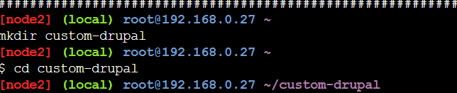

# devopsAssignment2

### creating directory


### creating compose file


### docker-compose.yml
```commandline
version: '2'

services:

  drupal:
    build: .
    ports:
      - 8080:80
    volumes:
      - web-modules:/var/www/html/modules
      - web-profiles:/var/www/html/profiles
      - web-themes:/var/www/html/themes
      - web-sites:/var/www/html/sites

  postgres:
    image: postgres:12.1
    environment:
      POSTGRES_PASSWORD: admin
    volumes:
      - web-data:/var/lib/postgresql/data

volumes:
  web-data:
  web-modules:
  web-profiles:
  web-themes:
  web-sites:
```
### Running compose file

### creating Dockerfile

### Dockerfile
```commandline
FROM drupal:8
RUN apt-get update && apt-get install -y git && rm -rf /var/lib/apt/lists/*
WORKDIR ~/var/www/html/themes
RUN git clone --branch 8.x-3.x --single-branch --depth 1 https://git.drupal.org/project/bootstrap.git && chown -R www-data:www-data bootstrap
WORKDIR ~/custom-drupal

```

### List the container


### commit custom-image

### tag custom-image

### push to docker hub

### config on port 8080


